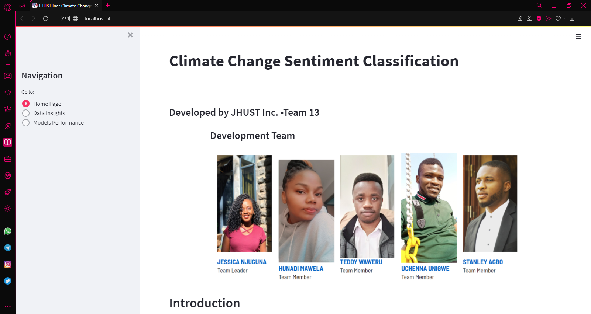

# Climate Change Sentiment Analysis

### Dev Team
- Jessica Njuguna
- Teddy Waweru
- Stanley Agbo
- Hunadi Mawela
- Uchenna Unigwe

## Introduction
 
Over the last four years, the earth has been the hottest on record. This is due to increased emissions of greenhouse gases cause by various human activities. With a temperature rise of over two degrees celsius, we are well over acceptable risks. The effects of the rapid climate change lead to flooding, drought, heatwaves and typhons which presents risks of mass displacement and increased socioeconomic tensions.

Many companies are interested in taking action to avert the current Climate Crisis. They are doing this by offering products and services that are environmentally friendly. To aid in their market research, the companies need to know what sentiments people hold about Climate Change based on their tweets. In addition, they would like to have an application where they can enter a tweet and predict the sentiment.

This is the task we addressed during this project, supervised by Explore Data Science Academy. 

## Project Summary

This is a Natural Processing Language Multiclass classification problem that we tackled using Jupyter Notebook. Various machine learning models were used, however, the Support Vector Classifier was selected due to its high accuracy of 73%. In addition, we derived insights on the dataset provided and lauched a Web App.

### Project Sections
1. Exploratory Data Analysis
2. Feature Engineering
3. Modelling & Model Sections
4. Web Development using Streamlit
5. Project Presentation

### Project Insights and Results
1. Majority of the tweets are Pro Climate Change.
2. Support Vector Classifier was the best model to predict climate change sentiments with 73% accuracy.
3. Web Application was launched using Streamlit and is hosted on the AWS Cloud Servers.

### Project Improvements
1. Scraping websites for the links on the tweet in the dataset.
2. Employing feature selection methods for the dataset.

### Web App Demo

Watch the demo below for how the Web Application works:

## Project Links
Check out the links below for more a more detailed view:

1. [Github Repository](https://github.com/JessWN/2110ACDS_T13)
2. [Jupyter Notebook](https://github.com/JessWN/2110ACDS_T13/blob/main/2110ACDS_T13.ipynb)
3. [Code for Web App](https://github.com/JessWN/2110ACDS_T13/blob/main/base_app.py)
4. [Project Presentation](https://docs.google.com/presentation/d/1-AIbZcDdUDmvVoIB4WoJcIZslbbdb6S9bujMNEgpuHw/edit?usp=sharing) 
